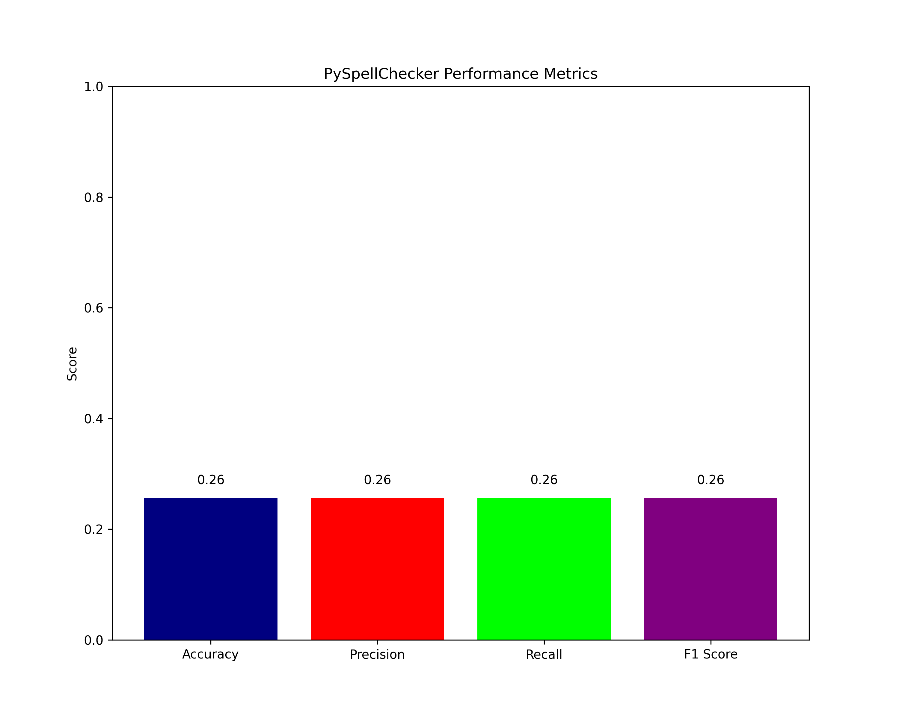
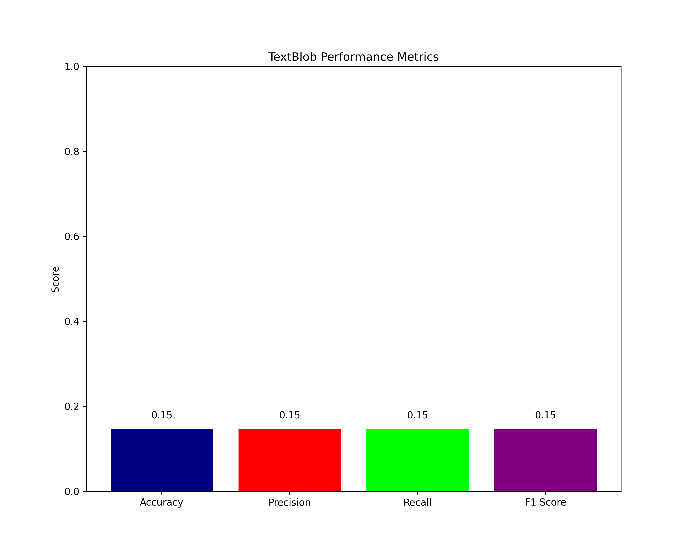

# Writing-Assistance-Tools-Evaluation
Evaluates available writing assistance tools


## Documentation 
* __tools__
    - spelling ckeckers like PySpellChecker library and TextBlob library are used in this project
        - PySpellChecker is lightweight, faster, and best for simple, standalone spell-checking tasks on common English words
        - TextBlob is more complex tool that provides NLP functionalities and can be used to correct misspellings in not complex contexts
    - matplotlib.pyplot module is used to prepare charts presenting results of PySpellChecker and TextBlob corrections
    - sklearn.metrics module from scikit-learn lib is used to calculate F-score of correction results for both correction libs

* __dataset used to evaluate PySpellChecker and TextBlob is '_missp.txt_' file available in this repository__
    - '_missp.txt_' dataset comes from [https://www.dcs.bbk.ac.uk/~ROGER/corpora.html](https://www.dcs.bbk.ac.uk/~ROGER/corpora.html)

        _"It is an amalgamation of errors taken from the native-speaker section (British or American writers) of the Birkbeck spelling error corpus, a collection of files of spelling errors gathered from various sources, available as separate files with detailed documentation from the Oxford Text Archive. It includes the results of spelling tests and errors from free writing, taken mostly from schoolchildren, university students or adult literacy students. Most of them were originally handwritten."_
    - if one want to evaluate those libs using own dataset it should be prepared like that:
    ```shell
    $correctly_spelled_word_1
    misspelling_1
    misspelling_2
    ...
    $correctly_spelled_word_2
    misspelling_1
    misspelling_2
    ...
    ```

* __metrics__
    - accuracy -> (well corrected words / total corrections)
    - precision -> TP / (TP + FP)
    - recall -> TP / (TP + FN)
    - f1-score -> 2*precision*recall / (precision + recall)
      - True Positives (TP): Model correctly suggests the right correction.
      - False Positives (FP): Model suggests a correction, but it’s incorrect.
      - False Negatives (FN): Model fails to suggest any correct correction when there is a misspelling.


## Report 

*  __approach and ideas__
    - I decided to evaluate tools that corrects given misspelled words without context
    - The idea was to test few of them, compare the results and decide if libs correcting words without context are usefull and effective and if so in which situations/under which conditions they can be usefull

* __results and conclusions__
    - for dataset _'missp.txt'_ results of used metrics - accuracy, precision, recall and f1-score - have the same value
        - it happens because used dataset contains only commonly known dictionary words so that each model can generate at least one potential correction for given misspellings - due to that FN (False Negtive) value is 0 and all metrics come down to accuracy
    - metrics would differ if one used dataset with less known words like slang or more misspelled examples for which model wouldn't be able to suggest corrections
    - for both models results/used metrics is approximately 0.3 (usually in range between 0.2 and 0.4)
    - PySpellChecker perfoms a bit better than TextBlob - PySpellChecker is bulilt for simple corrections like those and performs the best on simple dictionary datasets like the one used, beacuse it is far less complex than TextBlob it's also much faster model, on the other hand TextBlob produced a bit worse results in this experiment so that shows that TextBlob as NLP tool performs best when given a context not a single word
    - Although results of this experiment are quite low when it comes to misspelling corrections without given context, I find simple tools like those usefull in more advanced projects:
        - trained NLP models or LLM with given context would always outperform simple models like those but due to their complexness they are also much slower than tools like PySpellChecker
        - so while working with more complex text corrections writing assistnace tools could correct misspelings in 2 ways:
            - first, detect simple and common parts of text/code (like for loop structure) on which probability of good dictionary correction is high - on those text parts would be used simple spelling checker that would also perform pretty fast (to enhance performance I would add to those tools function that gets information of how often user/writer uses specific word and then with use of that function there would be choosen most probable correction from models list of possible corrections - for example model would choose the one that is used the most)
            - second, NLP models or LLMs would focus on correcting more complex parts that would require context to determine misspelling corrections with high probability of success.

    The eesults of an example script execution are saved as bar charts in .png format: 
   
    
    
    


## Run and locally reproduce the results

* __prepare environment__

   ```shell
    # Ubuntu / MacOS
    python3 -m venv venv
    source venv/bin/activate
    pip install -r requirements.txt
    ```

* __run script__
    ```shell
    python3 main.py --path 'path_to_dataset_file' --sample integer
    ```
    - --path or -p argument requires path to dataset file saved in same format as 'missp.txt'
    ($word is correctly spelled word and other ones are those misspelled to correct)
    - --sample or -s argument is integer number of how sets of correct word and list of it's misspellings would be corrected and evaluated
    (if number is bigger than number of such sets in whole dataset, then whole dataset would be corrected and evaluated)
    - __it's strongly recommended to reproduce results using '_missp.txt_' dataset which is already correctly formatted for DataPreparer.readData(path) method or preapare own dataset__

* __reproduced results__
    - results of running script and evaluating both libs are saved as bar charts in files _'results/PySpellChecker_Metrics.png'_ and _'results/TextBlob_Metrics.png'_
